# MuJoCo Ranger Piper for Robonix

<p align="center">
  <strong>简体中文</strong> | <a href="README.md">English</a>
</p>

<p align="center">
  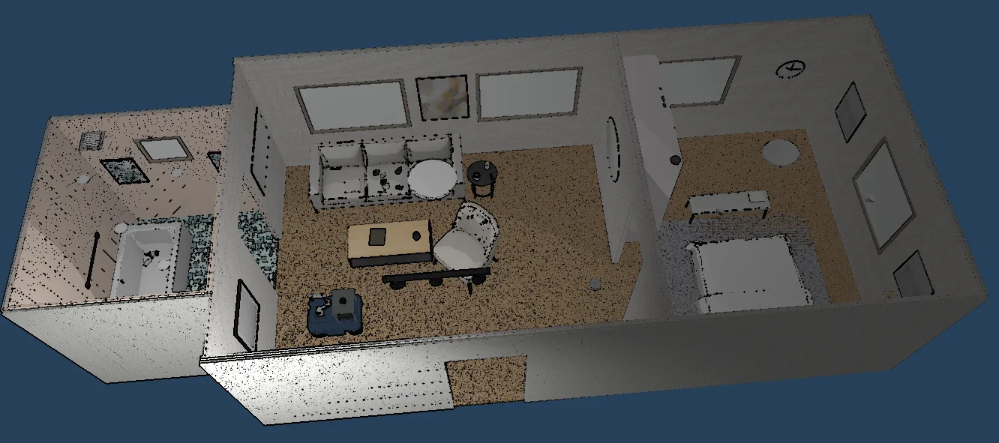
</p>

这是一个面向 Robonix 的 `Ranger Mini V3 + Piper` 仿真本体包。仿真容器可选择
Web 或原生 MuJoCo 后端，默认仍为 Web；启动后可直接执行 `rbnx boot` 加载本体，
再通过 `rbnx chat` 完成观察、
建图、导航、避障、底盘运动以及动态物体抓取和放置。

Web 后端支持 Gaussian Splatting SPZ 和带纹理 Mesh 室内环境；原生后端只支持
Mesh，选择 SPZ 会报错并退出。物理接触、LiDAR 和深度相机始终使用 MuJoCo 几何。环境资产与
本体能力解耦，不需要为每个房间复制一套 Robonix 本体包。

## 运行画面

### Web MuJoCo Viewer
<p align="center">
  <a href="docs/media/demos/navigation-and-cup-pick.mp4">
    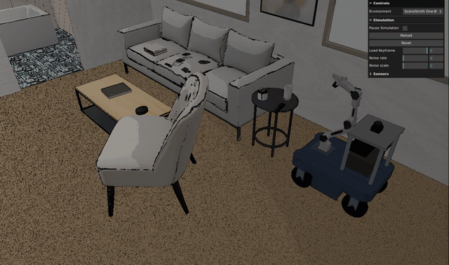
  </a>
</p>

<p align="center">
  <a href="docs/media/demos/navigation-and-cup-pick.mp4">观看 64 秒完整导航与水杯抓取演示</a>
</p>

| Gaussian Splatting | 带纹理 Mesh |
| --- | --- |
| 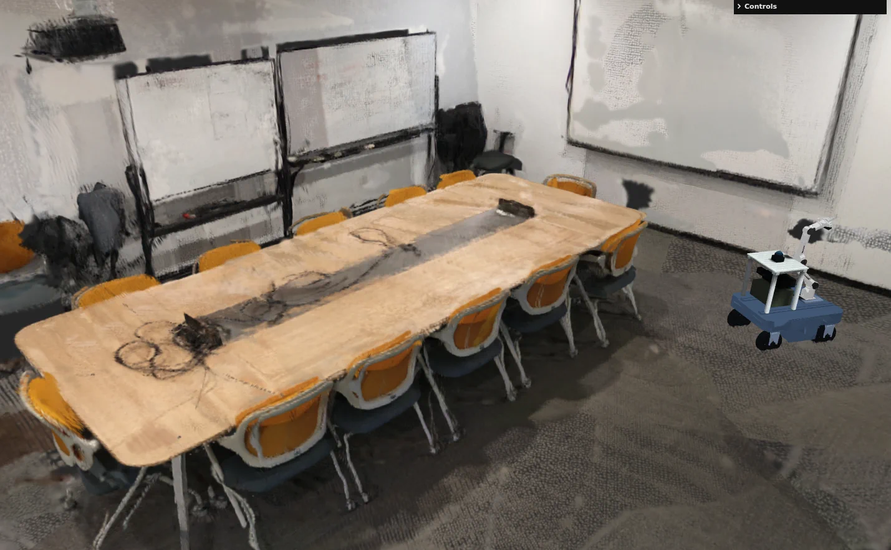 | 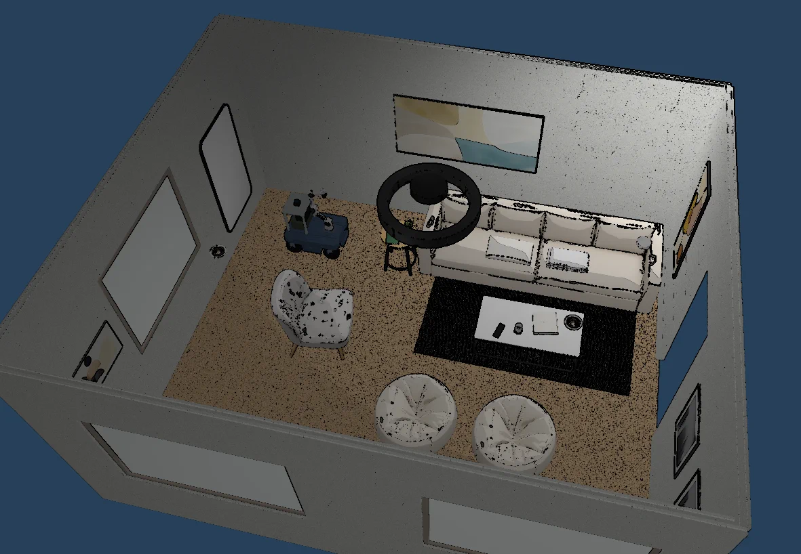 |
| Meeting Room | SceneSmith Living Room 030 |
| 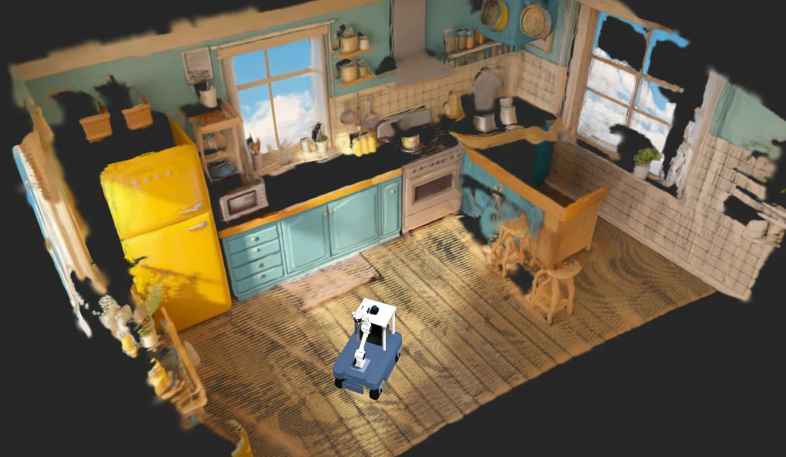 | 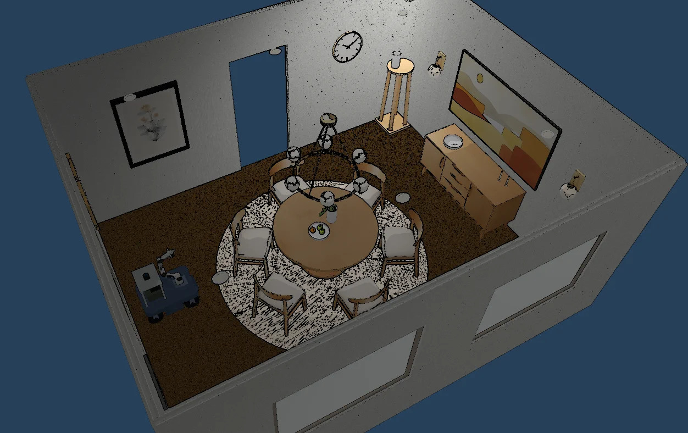 |
| Kitchen | SceneSmith Dining Room 036 |

更多环境截图见[场景画廊](#场景画廊)。演示媒体统一存放在 `docs/media/`。

### 原生 MuJoCo viewer

<p align="center">
  <a href="docs/media/demos/native-navigation-and-cup-pick.mp4">
    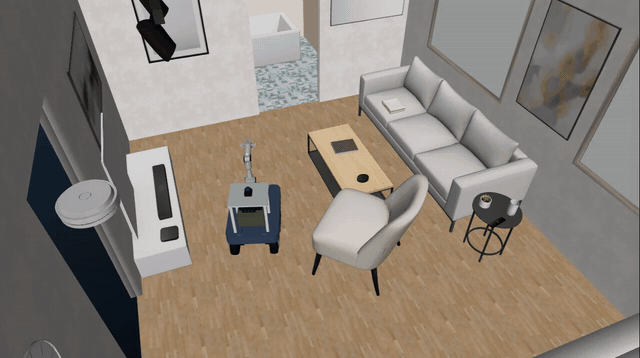
  </a>
</p>

<p align="center">
  <a href="docs/media/demos/native-navigation-and-cup-pick.mp4">观看 103 秒完整原生导航与水杯抓取演示</a>
</p>

原生 viewer 直接使用 MuJoCo 的硬件 OpenGL 渲染 Mesh 场景，材质、光照和场景整体
展示通常比 Web viewer 更清晰、稳定。但是原生 viewer 要求机器连接显示器，并存在可用的
X11 或 WSLg 图形会话；无显示器环境应使用 `--headless`，但 RGB 相机仍需要 GPU。
viewer 默认使用自由相机：右键拖动可平移视角，`Shift + 右键拖动`可水平平移，
左键拖动旋转，滚轮缩放。

| 默认公寓 | 餐厅 036 |
| --- | --- |
| 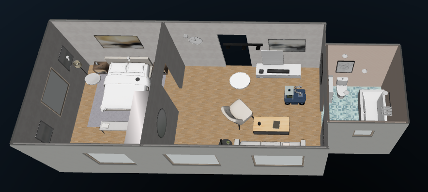 | 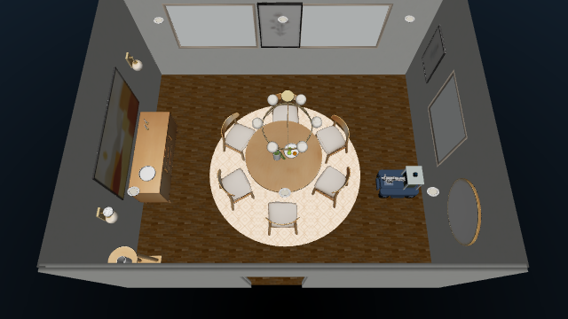 |

## 能力

| 部件或服务 | Provider | 对外能力 |
| --- | --- | --- |
| Ranger Mini V3 底盘 | `ranger_chassis` | 短距离运动、连续 Twist、里程计 |
| MID-360 LiDAR | `mid360_lidar` | 2D LaserScan、3D PointCloud2、单帧扫描 |
| MID-360 IMU | `mid360_imu` | 角速度和线加速度 |
| 前置 Gemini 336L | `front_camera` | RGB、深度、内参、外参、单帧采集 |
| Piper 腕部相机 | `wrist_camera` | RGB、深度、内参、单帧采集 |
| Piper 与夹爪 | `piper_ctl` | 关节状态/命令、TCP 位姿/命令、夹爪开合 |
| RTAB-Map | `mapping` | 在线地图、点云和 map-frame 位姿 |
| Nav2 | `nav2` | 目标点导航、动态限速和避障 |
| Scene | `scene` | 场景对象、空间关系和邻近导航目标 |
| Explore | `explore` | 基于占据地图的前沿探索 |
| Pick | `pick` | VLM 目标确认、物理抓取和放置 |

Audio 按本体包需求未接入。SPZ splat 和 SceneSmith 静态家具不可抓取；抓取使用
环境中明确注册的动态任务物体。

## 本体结构

```text
rbnx chat / rbnx ask
        |
Pilot + Executor + Atlas + Soma + Scene
        |
Mapping / Nav2 / Explore / Pick
        |
六个本地 primitive
        |
ROS 2 <-> WebSocket bridge <-> Web MuJoCo（默认，SPZ/Mesh）
                         \----> 原生 MuJoCo（Mesh，GPU viewer/RGB）
                               |-- 碰撞、传感器和动态物体
```

本体尺寸、footprint、组件层级和夹爪状态位于 `soma.yaml`；机器人坐标树位于
`urdf/ranger_piper.urdf`；RTAB-Map 与 Nav2 的本体专属参数保存在 `config/`。
每个本地 package 均包含 `package_manifest.yaml`、`config.spec` 和
`CAPABILITY.md`。更详细的边界说明见
[Robonix 接入设计](docs/ROBONIX_INTEGRATION.md)和
[仿真架构](docs/ARCHITECTURE.md)。

## 环境要求

本项目在 x86_64 Ubuntu 22.04、ROS 2 Humble、Docker 和 `rbnx 0.1.0` 上完成
端到端测试。新用户需要：

- Docker Engine 和 Compose plugin，当前用户可以执行 `docker ps`；
- Node.js 20 或更高版本、Python 3 和 `curl`；
- Web 后端需要支持 WebGL 2 的桌面图形会话；
- 原生后端需要 X11/WSLg、可用的硬件 OpenGL 和 `/dev/dxg`；
- 可用的 Robonix 源码树及 `rbnx` 命令；
- 首次构建时可访问 npm、GitHub 和 Playwright 下载站。

SPZ 在纯软件 WebGL 下开销较高，日常使用建议采用可见浏览器和 GPU。原生模式的
MuJoCo 物理步进仍在 CPU 上执行，viewer 和 RGB 离屏渲染使用 GPU；启动脚本会拒绝
`llvmpipe` 等软件 renderer。原生 `--headless` 只关闭 viewer，不关闭 GPU 相机渲染。

## 第一次安装

### 1. 安装 Robonix

若机器上还没有 Robonix，先按[官方方式](https://book.robonix.ai/)安装并登记源码树。

### 2. 获取并配置本体包

```bash
git clone <repository-url> ~/mujoco_robonix
cd ~/mujoco_robonix
cp .env.example .env
```

编辑 `.env`：

```dotenv
ROBONIX_SOURCE_PATH=/home/your-name/robonix
VLM_BASE_URL=your-model-url
VLM_API_KEY=replace-me
VLM_MODEL=your-model-name
# 可选；Bridge 镜像默认使用已安装的 Fast DDS
MUJOCO_RMW_IMPLEMENTATION=rmw_fastrtps_cpp
# Default simulator backend. Valid values: web, native.
# SIM_BACKEND=web
# Native mode opens the MuJoCo viewer unless this is 1.
# SIM_HEADLESS=0
# Native mode rejects software OpenGL unless explicitly disabled.
# SIM_GPU_REQUIRED=1
```

`VLM_API_KEY` 同时供 Pilot 和抓取 skill 使用，不能提交到 Git。它必须在项目
`.env` 中填写，或在执行 `source scripts/env.sh` 前由当前 shell 导出。

### 3. 构建

```bash
cd ~/mujoco_robonix
bash scripts/bootstrap.sh
```

bootstrap 会执行以下工作：

1. 通过 lockfile 安装前端依赖和 Playwright Chromium；
2. 构建 ROS 2 Humble bridge 镜像；
3. 对六个 primitive 和 Pick skill 执行 `rbnx validate`；
4. 执行 `rbnx build -f robonix_manifest.yaml`，获取并构建 Mapping、Navigation 和
   Explore 官方包。

`node_modules/`、`.venv-codegen/`、`rbnx-build/`、`rbnx-boot/` 和运行日志均为
可再生内容，已由 `.gitignore` 排除。

## 启动本体包

启动方式与 Robonix Webots example 一致：仿真、本体栈和对话各占一个终端。

### 终端 1：启动 MuJoCo 仿真

```bash
cd ~/mujoco_robonix
bash sim/start.sh
```

未指定时使用 `web` 后端。脚本启动 bridge 和选定的仿真运行时，并保持在前台。看到
`[sim/start] ... ready` 后再启动 Robonix。默认页面地址是
`http://127.0.0.1:5180/?environment=scenesmith_house_187`，bridge 健康检查地址是
`http://127.0.0.1:8766/health`。Bridge 若在 Docker 启动阶段异常退出，脚本会先
保存容器输出并有限重试；最终失败时检查 `.runtime/bridge.log` 和
`.runtime/browser.log`。
项目使用专用的 `MUJOCO_RMW_IMPLEMENTATION`，不会继承其他 ROS/Robonix 终端中的
通用 `RMW_IMPLEMENTATION`；当前 Humble Bridge 镜像应保持为 `rmw_fastrtps_cpp`。

选择原生 MuJoCo viewer（要求连接显示器并具备 X11/WSLg 图形会话）：

```bash
bash sim/start.sh --backend native --viewer --environment scenesmith_house_187
```

不显示 viewer、但保留 GPU RGB 渲染：

```bash
bash sim/start.sh --backend native --headless --environment scenesmith_house_187
```

也可以在 `.env` 中设置 `SIM_BACKEND=web|native`、`SIM_HEADLESS=0|1`。原生模式只
支持 `visualMode=mesh`；例如 `--backend native --environment kitchen` 会打印
`native backend does not support SPZ` 并以非零状态退出。GPU 检测默认开启，仅在
明确接受软件渲染的诊断环境中才设置 `SIM_GPU_REQUIRED=0`。

只有正常启动仿真后才能执行后续步骤，正常启动终端应该打印类似如下日志：
```bash
...
[+] up 1/1
 ✔ Container mujoco_robonix_sim Started                                                                 0.1s
[sim/start] starting static web server
[sim/start] launching browser: http://127.0.0.1:5180/?environment=scenesmith_house_187
[sim/start] bridge ready: scenesmith_house_187 {'state': 15, 'pick_status': 1, 'scan': 6, 'pointcloud': 6, 'camera': 1}

[sim/start] MuJoCo UI:      http://127.0.0.1:5180/?environment=scenesmith_house_187
[sim/start] Bridge health: http://127.0.0.1:8766/health
[sim/start] In terminal 2:  source scripts/env.sh && rbnx boot
[sim/start] Ctrl-C stops only the simulator.
```

### 终端 2：加载 Robonix 本体包

```bash
cd ~/mujoco_robonix
source scripts/env.sh
rbnx boot
```

不要从其他目录直接执行默认 `rbnx boot`，否则它找不到本仓库的
`robonix_manifest.yaml`。正常启动时六个 primitive 和 Mapping/Nav2/Scene 为
`ACTIVE`；`pick` 与 `explore` 是按需技能，初始显示 `INACTIVE` 属于正常状态。

在另一个已加载环境的终端检查：

```bash
cd ~/mujoco_robonix
source scripts/env.sh
rbnx caps -v
rbnx tools
curl -fsS http://127.0.0.1:8766/health
```

### 终端 3：使用 rbnx chat

```bash
cd ~/mujoco_robonix
source scripts/env.sh
rbnx chat
```

可以依次尝试：

```text
当前本体有哪些能力？
拍摄前置相机图像并描述当前视野
向前移动 0.3 米
开始自由探索客厅、卧室和浴室并建图，最长运行 300 秒，最大速度 0.18 米每秒；返回探索任务 ID
导航到地图坐标 x=3.92, y=3.25，最终朝向 yaw=0；到达后抓取边桌上的水杯
放下手中的物体
```

边桌上还可以抓取“电视遥控器”和“多肉盆栽”。探索是异步任务：只启动一次，保存
返回的任务 ID，之后用“查询该探索任务状态”轮询；不要为查询进度反复下达新的
“开始探索”命令。探索时不要同时发送手动底盘、导航或抓取命令。

非交互调试可以使用：

```bash
rbnx ask "开始自由探索客厅、卧室和浴室并建图，最长运行 300 秒，最大速度 0.18 米每秒；返回探索任务 ID"
rbnx ask "导航到地图坐标 x=3.92, y=3.25，最终朝向 yaw=0；到达后抓取边桌上的水杯"
```

## 场景

| 环境 ID | 页面名称 | 视觉 | 动态抓取物 |
| --- | --- | --- | --- |
| `scenesmith_house_187` | SceneSmith One-Bedroom Apartment 187 - Mesh（默认，客厅/卧室/浴室） | Mesh | 水杯、电视遥控器、多肉盆栽 |
| `kitchen` | Kitchen - SPZ | SPZ | 无 |
| `meeting_room` | Meeting Room - SPZ | SPZ | 无 |
| `scenesmith_room_005` | SceneSmith Bedroom 005 - Mesh | Mesh | 无 |
| `scenesmith_room_030` | SceneSmith Living Room 030 - Mesh | Mesh | 玻璃罐、精装书、盆栽 |
| `scenesmith_room_036` | SceneSmith Dining Room 036 - Mesh | Mesh | 无 |
| `scenesmith_room_125` | SceneSmith Office 125 - Mesh | Mesh | 无 |

### 场景画廊

#### Web MuJoCo Viewer

| 默认公寓 | 卧室 |
| --- | --- |
|  | 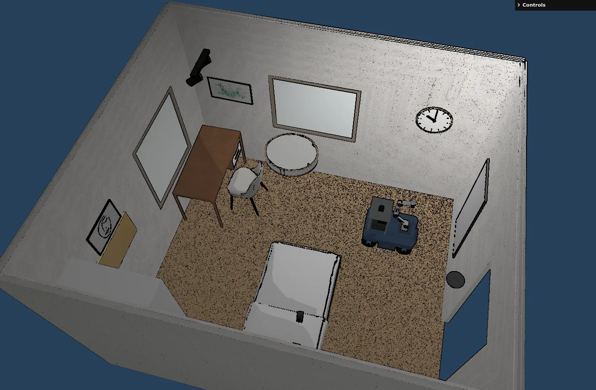 |
| SceneSmith One-Bedroom Apartment 187 | SceneSmith Bedroom 005 |
| 客厅 | 餐厅 |
|  |  |
| SceneSmith Living Room 030 | SceneSmith Dining Room 036 |
| 办公室 | Meeting Room SPZ |
| 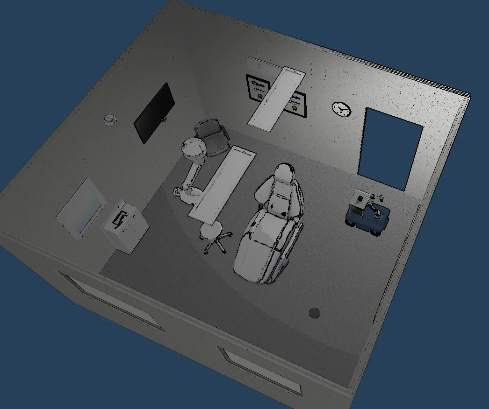 |  |
| SceneSmith Office 125 | Meeting Room |

Kitchen SPZ：


#### 原生 MuJoCo Viewer

原生 MuJoCo 支持的全部 Mesh 场景如下：

| 默认公寓 | 餐厅 036 |
| --- | --- |
|  |  |
| 卧室 005 | 客厅 030 |
| 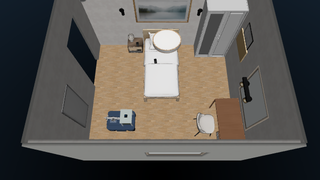 | 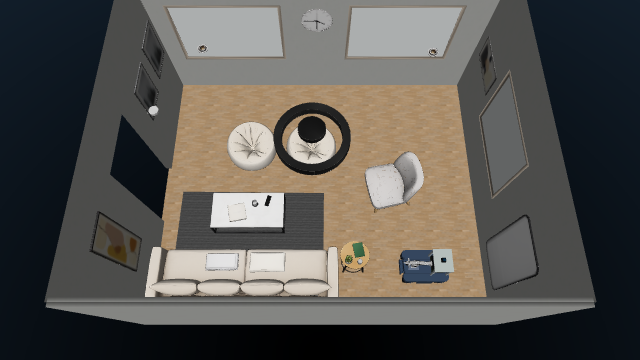 |
| 办公室 125 | |
| 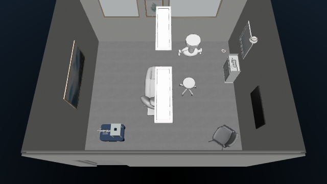 | |

切换场景时先停止终端 2 的 Robonix，再停止终端 1，然后使用新的环境 ID 重启：

```bash
bash sim/start.sh --environment scenesmith_room_005
```

环境改变不会改变本体 provider ID 和能力。`visualMode` 由
`assets/environments/manifest.json` 自动选择，不是用户启动参数。
`kitchen` 和 `meeting_room` 必须使用 Web 后端；所有 Mesh 环境均可使用 Web 或原生后端。

## 验证

完整系统启动在默认的 `scenesmith_house_187` 后执行；同一脚本适用于 Web 和原生后端：

```bash
cd ~/mujoco_robonix
bash scripts/acceptance.sh
```

验证会检查：清单 provider 状态、两套 RGB-D、LiDAR、点云、IMU、非空占据栅格、
Nav2 lifecycle、通过 Nav2 到达操作位的精度、底盘实际里程，以及水杯持续持稳、
安全放置和机械臂归位。脚本会重置和移动机器人，
不要与人工控制或 `rbnx chat` 任务并发运行。

静态包校验可单独执行：

```bash
source scripts/env.sh
for package_dir in primitives/* skills/pick; do
  [[ -f "$package_dir/package_manifest.yaml" ]] && rbnx validate "$package_dir"
done
```

原生模型、SPZ 拒绝、射线传感器和 GPU RGB 的快速测试可在原生容器运行时执行：

```bash
docker exec mujoco_robonix_sim python3 /workspace/sim/tests/native_smoke.py
```

## 停止

先在终端 2 按 `Ctrl-C`，或从另一个已加载环境的终端执行：

```bash
rbnx shutdown
```

再在终端 1 按 `Ctrl-C`。也可显式停止仿真：

```bash
bash sim/stop.sh
```

`sim/stop.sh` 不会终止 Robonix，`rbnx shutdown` 也不会关闭仿真运行时，两层生命周期
相互独立。Web 页面默认关闭键盘底盘控制和 actuator 调试项；开发时追加 `&dev=1`
可以恢复这些面板。无论是否为开发模式，只有机器人本体可拖动，视角可旋转。

## 添加场景

场景注册表是 `assets/environments/manifest.json`。SPZ 环境的最小运行资产为：

```text
assets/environments/my_room/
  scene.spz
  collision.xml
  transform.json
  spawn.json
```

`collision.xml` 必须包含连续地面和障碍物，传感器可见环境 geom 使用
`group="3"`；`transform.json` 配准 SPZ 与 MuJoCo；`spawn.json` 给出无碰撞出生
位姿。PLY 转 SPZ、PLY 转碰撞盒和出生点搜索是离线环境制作流程，不属于本体
primitive。提交最终运行资产即可，原始 PLY、模型缓存和诊断中间文件已被忽略。

Mesh 环境的最小运行资产为：

```text
assets/environments/my_mesh_room/
  scene.xml
  index.json
  spawn.json
  objects.xml       # 可选，仅在该环境含动态物体时提供
  meshes/...
```

SceneSmith Room 和 House 数据可通过 `scripts/prepare-scenesmith.py` 静态化家具、
生成碰撞、搜索出生点并裁剪未引用资产。House 转换会识别多个地板区域，只封闭
地板并集的外轮廓，保留房间之间的通道，避免 Explore 把室外未知区当成目标。
本项目默认场景的复现命令为：

```bash
python3 scripts/prepare-scenesmith.py \
  --source third_party/scenesmith/source/scene_187/mujoco \
  --output assets/environments/scenesmith_house_187 \
  --scene-id scenesmith_house_187 \
  --source-archive scene_187.tar \
  --source-subset House \
  --interactive-config config/scenes/scenesmith_house_187.interactive.json
```

`--interactive-config` 将指定的 SceneSmith 小物体从静态场景抽出，自动生成环境级
`objects.xml`、freejoint 和紧致碰撞盒；配置还记录推荐抓取位姿。环境清单需设置
`objectsPath`，动态物体名称使用 `task_` 前缀。机器人包本身不携带场景物体。

## 限制与安全

- 本项目是仿真本体包，不包含真实 Ranger CAN、Piper CAN 或设备 SDK；
- SPZ 只提供视觉，碰撞和传感器真实性取决于独立 collision XML 的质量；
- Pick 是受控动态物体上的垂直抓取闭环，不是任意家具或任意 6-DoF 抓取规划；
- 前置相机用于 Scene/Mapping，腕部相机用于抓取确认，二者不能依赖 Atlas 顺序互换；
- 运行验证会主动移动底盘和机械臂，并改变动态物体状态。

## 目录

```text
assets/robots/ranger_mini_v3_piper/   Ranger、Piper 和传感器
assets/environments/                  可替换的 SPZ/Mesh 运行环境
primitives/                           六个本地 Robonix primitive
skills/pick/                          VLM 目标确认和抓取/放置 skill
sim/bridge/                           仿真运行时与 ROS 2 双向 bridge
sim/native/                           原生 MuJoCo 场景、控制器、传感器和 viewer
sim/tests/                            端到端运行时验证
config/                               RTAB-Map 与 Nav2 本体参数
docs/media/                           README 截图与演示视频
urdf/ + soma.yaml                     本体拓扑、坐标树和 footprint
robonix_manifest.yaml                 rbnx boot 部署入口
scripts/                              构建、环境、验证和场景工具
```

## 上游与许可证

- [Robonix](https://github.com/syswonder/robonix)、
  [Robonix Book](https://github.com/syswonder/robonix-book)和
  [真实 Ranger Mini v3 本体包](https://github.com/syswonder/robot-agilex-ranger_mini_v3)：
  package、deployment、Soma 和启动流程参考；
- [MuJoCo-GS-Web](https://github.com/Vector-Wangel/MuJoCo-GS-Web)：浏览器 MuJoCo
  与 Gaussian Splatting 同场景渲染基础；
- [MuJoCo Menagerie AgileX Piper](https://github.com/google-deepmind/mujoco_menagerie/tree/main/agilex_piper)：
  Piper MJCF 和 mesh；
- [SceneSmith](https://github.com/nepfaff/scenesmith) 与
  [SceneSmith Example Scenes](https://huggingface.co/datasets/nepfaff/scenesmith-example-scenes)：
  带纹理 Mesh 室内场景与 House 187 运行资产；
- [Spark](https://github.com/sparkjsdev/spark)：SPZ 渲染；
- [MuJoCo-LiDAR](https://github.com/discoverse-dev/MuJoCo-LiDAR)：批量射线传感器参考。

项目代码采用 Apache-2.0。第三方资产的许可证与 NOTICE 位于对应资产目录；重新
分发时需要同时遵守其上游许可证。
